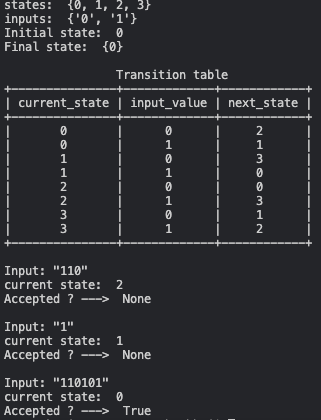

# Packages
Install packages: 

    pip3 install -r requirementes.txt

# Automaton

### I. Deterministic Finite Automaton (DFA)

#### 1. Definition  

- A finite-state machine that accepts or rejects a given string of symbols, by running through a state sequence uniquely determined by the string.
- A deterministic finite automaton M is a 5-tuple, (Q, Σ, δ, q0, F), consisting of

 
    - a finite set of states Q
    - a finite set of input symbols called the alphabet Σ
    - a transition function δ : Q × Σ → Q
    - an initial or start state q0 in Q
    - a set of accept states F is a subset of Q

2. Input

- Q: a set of integers
- Σ: a set of input (char)

- δ: list of transitions
  
- transition :
  
        {
   
            'current_state': ... , 
   
            'input_value': ..., 
   
            'next_state': ...
            
        }

- q0: a state in Q

- F:  a subset of Q

3. Example

    
